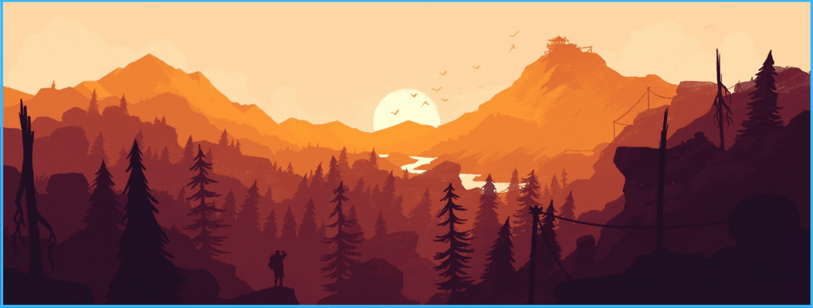
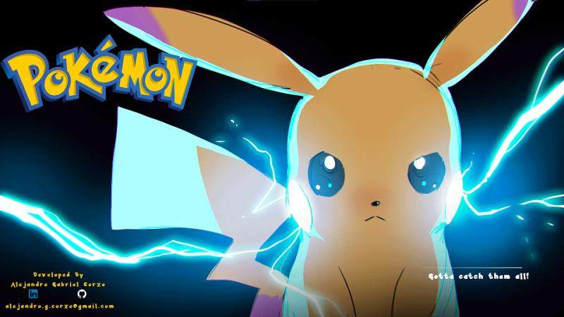
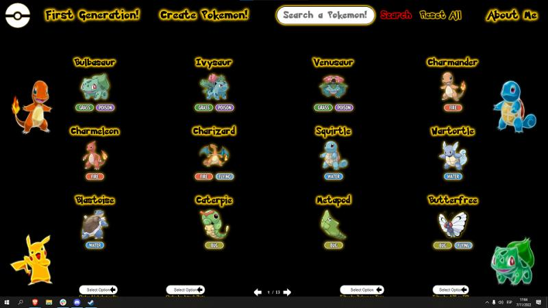
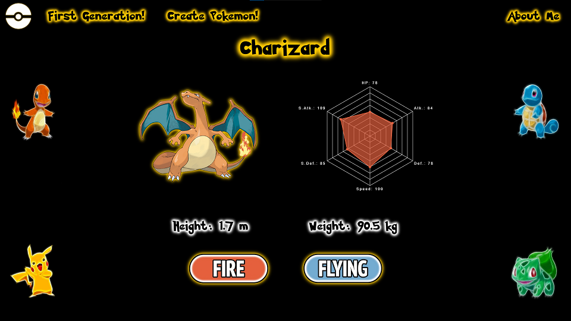
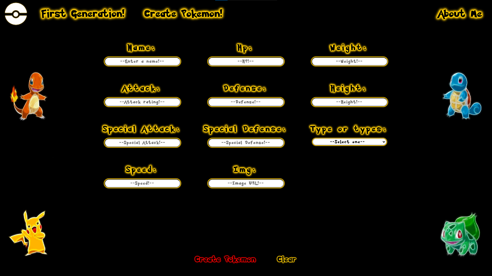

<h1 align="center">
 Full Stack Developer 
</h1>

Hi there! 👋 My name is Alejandro Gabriel Corzo. I started my path in the Web Development world 1 year ago. Among other courses and workshops, I am a certified Full Stack Developer in HENRY bootcamp, adding +1200 hours of academic experience in programming with real, individual and group projects.

I love the idea of creating and providing solutions wherever they are needed. I seek to apply these passions in web development where I am convinced that I can extensively use my creativity and problem solving skills. I like to learn new things, have an organized routine and enjoy constant learning. I really enjoy working in a group and I am also very good individually.

Why me? 🙋‍♂️
I am a curious person and always looking for the best way to accomplish tasks. I am willing to learn from others and to help those in need. According to this point of view, I believe that working in this way can achieve great results and better human relations.

## ✨ Skills ✨

## ✨ Projects ✨

<a href="https://github.com/AlejandroGCorzo/PI-Pokemon-Henry">🔥 Pokemon App 🔥</a>
 
<a href="https://pi-pokemon-front-agc.vercel.app/">🎮 Visit site 🎮</a>

<a href="https://github.com/AlejandroGCorzo/Mi-Scusi-Books">📚 Mi Scusi Books App 📚</a>
 
<a href="https://mi-scusi-books.vercel.app/">😎 Visit site 😎</a>

## ✨ GitHub Stats ✨

&nbsp;

### Contact 💼

